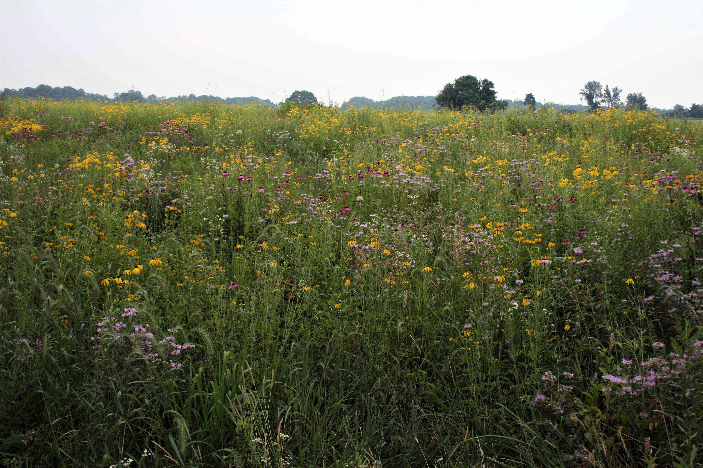
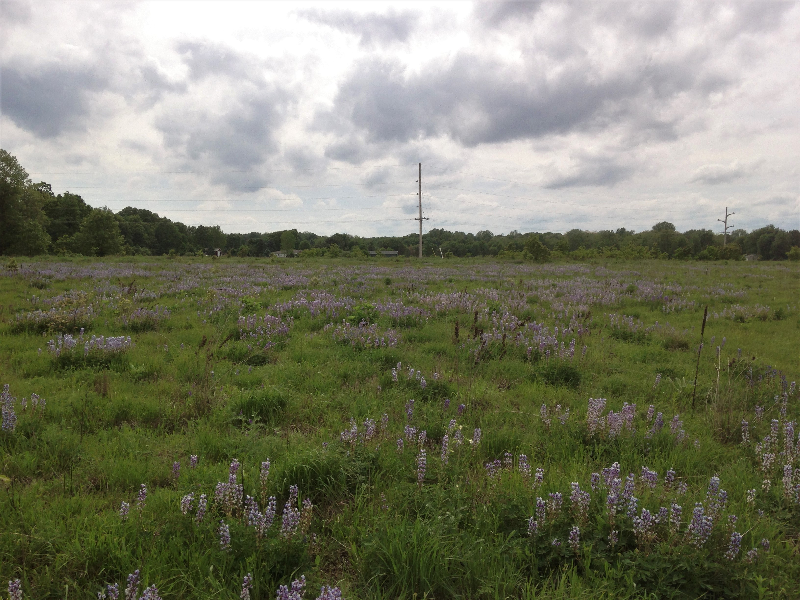

My research interests lie in understanding the fundamental drivers of community assembly, diversity ecosystem function relationships, and the coupling of this knowledge with concepts in and approaches to restoration ecology.  I work in Oak savannas at Cedar Creek LTER, restored prairies in southwestern Michigan, and an experimental prairie system at KBS LTER. My research focuses on three core areas:

### Impacts of bison re-introduction on Oak Savanna plant communities

Oak savanna is one of Minnesota’s most threatened ecosystems. Today, less than 0.1% of savanna
remains, and most have lost their native species as the lack of fire allows trees to
dominate and shade them out.

Savanna restoration research at Cedar Creek started in 1965 and has shown that prescribed fire
eliminates shrubs and non-savanna tree species and restores savanna species. However, this research
has also shown that these frequent fires are preventing oaks from regenerating. It is now clear that fire,
by itself, is leading to the slow loss of savanna as oaks are not replacing themselves.

Grazing by large herbivores, such as bison, may be essential for savanna restoration and preservation as
bison preferentially graze the most abundant native grasses. When not grazed, these grasses compete
with oak seedlings and, when these ungrazed grasses burn, their high abundance causes intense fires
that kill oak seedlings. By introducing bison to the oak savannas at Cedar Creek we hope to better
understand how we might preserve Minnesota’s oak savannas long into the future.

### Testing theory in trait-based community assembly

Understanding how a species’ traits interact with its environment to determine performance is 
the conceptual underpinning for most trait-based community assembly research. However, the field has 
often struggled to move beyond simply correlating averaged trait values with environmental conditions 
to approaches that simultaneously consider functional traits, environmental conditions, and 
performance.

My work has attempted to push the field forward by using experimental manipulations in a 
restoration setting to: 1) Understand whether similarity in functional traits between the current plant 
community and invaders or trait-environment matching mediates the success of the invading species, 
and 2) Evaluate how trait environment interactions determine seedling establishment success in newly 
restored prairies. 

### Linking community assembly and biodiversity ecosystem function theory using functional traits

Plant functional traits have a great potential for linking the two major goals of ecological 
restoration, community assembly and ecosystem function. Yet, this potential has been poorly realized.

I have approached this connection in two ways: 1) Using functional traits to link 
environmental conditions and ecosystem functions within a restoration to understand community 
assembly and the direct and indirect effect of environmental conditions on ecosystem functions, and 2) 
Using restoration as a system to better understand diversity-ecosystem function relationships and apply 
this to real world systems by incorporating other metrics of biodiversity, considering landscape level 
variation in environmental conditions, and predicting multiple different ecosystem function across and 
within sites simultaneously.
